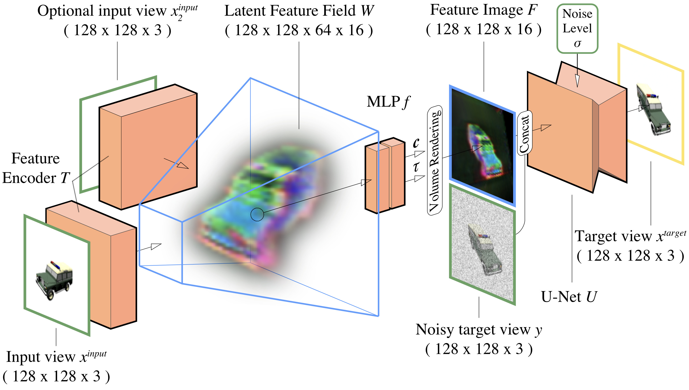

## GeNVS: Generative Novel View Synthesis with 3D-Aware Diffusion Models Official PyTorch implementation coming soon

**Generative Novel View Synthesis with 3D-Aware Diffusion Models** 
Eric R. Chan*, Koki Nagano*, Matthew A. Chan*, Alexander W. Bergman*, Jeong Joon Park*, Axel Levy, Miika Aittala, Shalini De Mello, Tero Karras, Gordon Wetzstein
 https://nvlabs.github.io/genvs/ 

Abstract: *We present a diffusion-based model for 3D-aware generative novel view synthesis from as few as a single input image. Our model samples from the distribution of possible renderings consistent with the input and, even in the presence of ambiguity, is capable of rendering diverse and plausible novel views. To achieve this, our method makes use of existing 2D diffusion backbones but, crucially, incorporates geometry priors in the form of a 3D feature volume. This latent feature field captures the distribution over possible scene representations and improves our method's ability to generate view-consistent novel renderings. In addition to generating novel views, our method has the ability to autoregressively synthesize 3D-consistent sequences. We demonstrate state-of-the-art results on synthetic renderings and room-scale scenes; we also show compelling results for challenging, real-world objects.*

For business inquiries, please visit our website and submit the form: [NVIDIA Research Licensing](https://www.nvidia.com/en-us/research/inquiries/)
